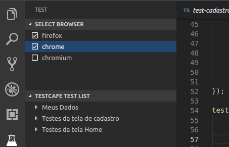
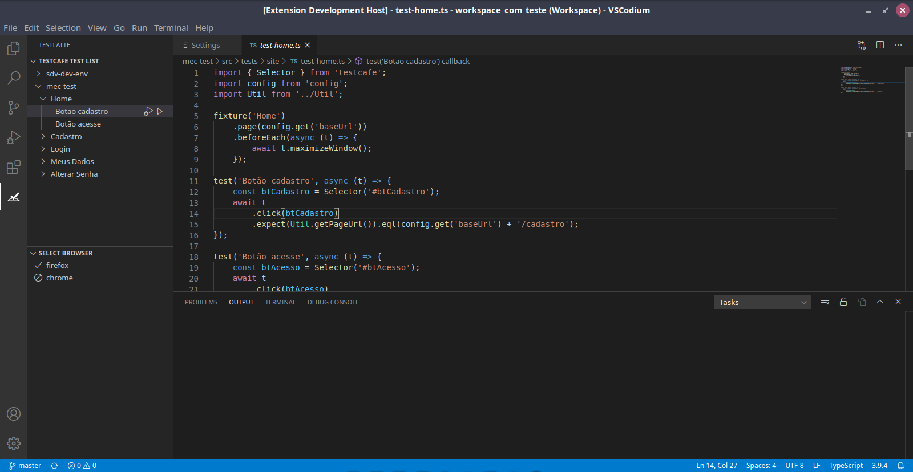
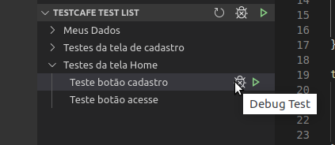
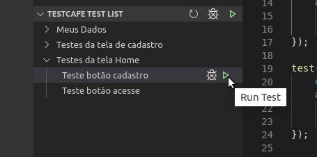
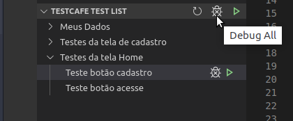
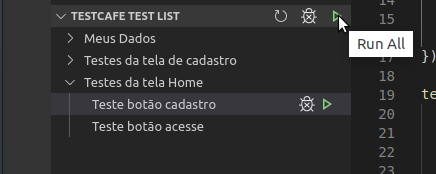

# TestLatte for Visual Studio Code

Testlatte is a Visual Studio Code extension designed to assist in running and debugging Testcafe tests. It scans your folder for tests and displays them in the side panel of VSCode.

TestLatte is available on [Visual Studio Marketplace](https://marketplace.visualstudio.com/items?itemName=sshimono.testlatte) and on [Eclipse Open VSX](https://open-vsx.org/extension/sshimono/testlatte)

## Features

#### Shows a list of installed browsers and allows you to select one or more browsers to run your tests.

#### Shows a list of tests grouped by fixture.

#### Navigate to your test or fixture clicking on the test/fixture name.

#### Debug or Run your test or fixture clicking on the debug icon or on the run icon.

#### Debug or Run all tests clicking on the debug all icon or on the run all icon.

## Requirements

It's recommended you install [TestCafé](https://github.com/DevExpress/testcafe) on your project as a local package.

TestLatte will look for TestCafé in the default location `[testWorkspaceFolder]/node_modules/testcafe/bin` folder, where `testWorkspaceFolder` is the workspace folder of the corresponding test.

If TestCafé is not installed at the default location, it is possible to configure TestCafé's module path in TestLatte configuration settings.

## Extension Settings

This extension contributes the following settings:

* `testlatte.filePath`: Directory from which to search and run the tests. Default value is `test/`
* `testlatte.customArguments`: Custom arguments to TestCafé command line.
* `testlatte.testcafePath`: Path to the TestCafe module used to execute the tests. If it is not configured it will use the path `[testWorkspaceFolder]/node_modules/testcafe/bin/testcafe.js`, where `testWorkspaceFolder` is the workspace folder of the corresponding test.

## Support TestLatte

TestLatte is free to use, but if you liked our work and want to support the project, you can make a donation clicking on the button below:

